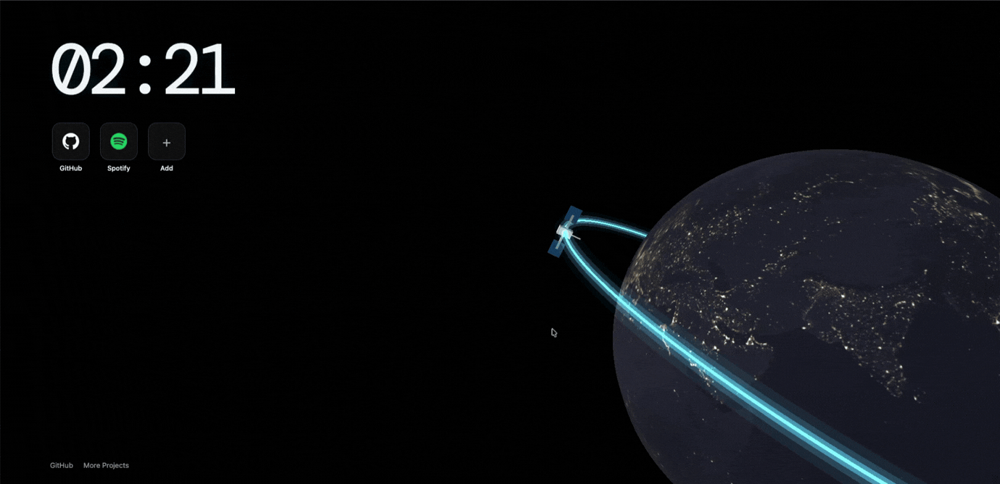

# What's Above Me?
> 
> A new tab page for your web browser showing the Earth and the ISS, along with live position details! Powered by Three.js and Vite. Check out a preview [here](https://ronakbuilds.tech/whats-above-me)



## Installation

1. Download `dist.crx` from the [Releases page](https://github.com/fourtysevencode/whats-above-me/releases), or from the root of this repository.
2. In Chrome, open `chrome://extensions`.
3. Turn on **Developer mode** using the toggle in the top-right corner.
4. Drag `dist.crx` onto the `chrome://extensions` page and drop it.
5. Click **Add extension** when Chrome asks.
6. Open a new tab. You should see the Earth, the ISS and the clock.

### If Chrome blocks or disables the `.crx`
On Windows and macOS, Chrome often refuses extensions that aren't from the Chrome Web Store, or installs them already turned off. If that happens, load the extension unpacked instead:

1. Make a copy of `dist.crx` and rename the copy to `dist.zip`.
2. Unzip it into a folder. A `.crx` is a zip file with an extra header. If your unzip tool complains, try a different one, such as 7-Zip or `unzip` in a terminal. Alternatively, build the folder yourself (see [Development](#development)).
3. In `chrome://extensions`, with **Developer mode** on, click **Load unpacked** and choose that folder.

When Chrome asks, accept the permissions:
- **Favicons:** shows each shortcut's icon from Chrome's own favicon cache.
- **Read data on `api.wheretheiss.at`:** fetches the ISS's live position.

## Features
- **3D Earth** that rotates slowly and switches to the night map (city lights) between 7:00pm and 5:00am.
- **ISS on a glowing orbit.** Hover over the ISS to see its live latitude, longitude, altitude and velocity, refreshed every 5 seconds.
- **Clock** in the top-left corner.
- **Shortcut tiles** under the clock:
  - Click **+** to add a website.
  - Right-click a tile to remove it.
  - Shortcuts are saved in your browser.

## Development

Requirements: [Node.js](https://nodejs.org/) 20 or newer.

```bash
npm install
npm run dev     # local dev server at http://localhost:5173
npm run build   # production build into dist/
```

To test the extension from source:
1. Run `npm run build`.
2. In `chrome://extensions`, click **Load unpacked** and select the `dist` folder.
3. After making changes, run `npm run build` again and click the reload ↻ icon on the extension's card.

### Packing a new `.crx`
1. In `chrome://extensions`, click **Pack extension**.
2. Choose the `dist` folder as the extension root directory.
3. Reuse the same private key (`dist.pem`) every time, so the extension keeps the same ID and updates install over the old version.

Keep `dist.pem` private. It is listed in `.gitignore` and must never be committed.

## Project structure
```
index.html              Page layout: clock, shortcuts, links, ISS info box
src/main.js             Three.js scene, ISS data, shortcuts logic
src/style.css           Styles
public/manifest.json    Chrome extension manifest (new tab override)
public/textures/        Earth day and night textures
```

## Credits
- ISS position data: [Where the ISS at?](https://wheretheiss.at/) API
- Earth textures: [Solar System Scope](https://www.solarsystemscope.com/textures/)
- Built with [Three.js](https://threejs.org/) and [Vite](https://vite.dev/)

Made for Stardance | Hackclub 2026

